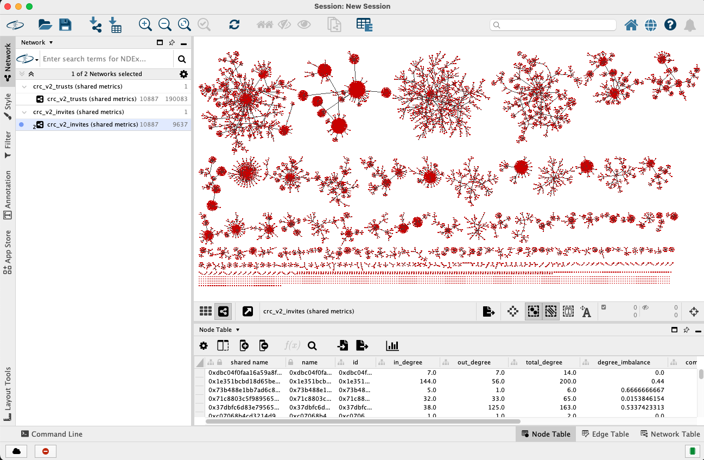
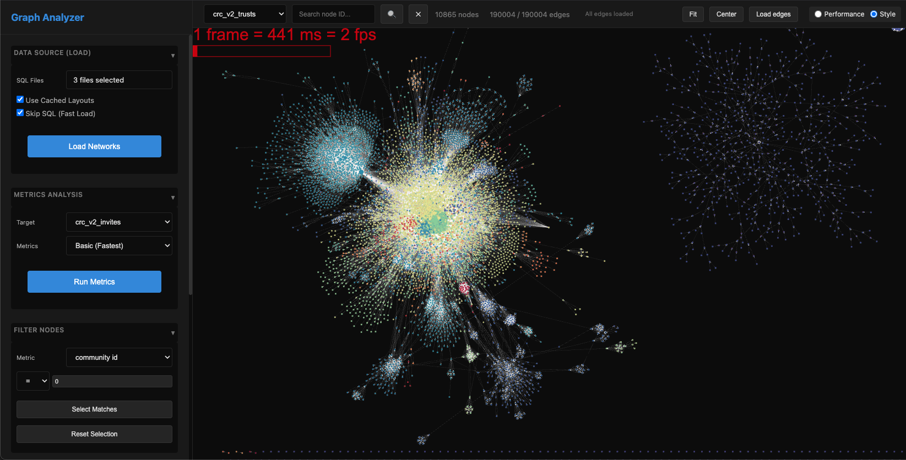

# Graph Analyzer


**A comprehensive toolkit for analyzing, visualizing, and managing trust networks.**

This toolkit bridges high-performance Python graph metrics with **Cytoscape Desktop** for deep analysis and provides a **Web Viewer** for sharing interactive visualizations in the browser.

---

## Repository Structure

```text
.
├── README.md                  # This documentation
├── .env                       # Configuration file (DB credentials, options)
├── requirements.txt           # Python dependencies
├── graph_metrics.py           # Core library: Calculates 120+ NetworkX metrics
│
├── cytoscape/                 # Desktop Visualization Tools
│   ├── stream_to_cytoscape.py # Script: Stream graphs to Cytoscape Desktop
│   ├── styles.xml             # Vizmap styles
│   └── styles_stream.xml      # Streaming styles
│
├── web_viewer/                # Web Application
│   ├── app.py                 # FastAPI Backend
│   ├── requirements.txt       # Web-specific dependencies
│   ├── static/                # Frontend assets (JS/CSS/HTML)
│   └── layout_service/        # Node.js Layout Engine (Optional)
│       ├── layout_server.js
│       └── package.json
│
├── blacklist_tools/           # Database Management
│   └── update_blacklist.py    # Script: Manage blacklist.db
│
├── sql/                       # SQL Definitions (Graph Layers)
│   ├── crc_v2_trusts.sql
│   ├── crc_v2_invites.sql
│   └── ...
│
└── data/                      # Data Storage
    └── blacklist.db           # SQLite Database
````

-----

## Installation

### 1\. Python Environment (Core)

```bash
python3 -m venv venv
source venv/bin/activate        # Windows: venv\Scripts\activate
pip install -r requirements.txt
pip install -r web_viewer/requirements.txt
```

### 2\. Node.js Environment (Optional Layout Service)

If running the Web Viewer without Cytoscape Desktop, you need the Node.js layout service.

```bash
cd web_viewer/layout_service
npm install
```

### 3\. Configuration (`.env`)

Create a `.env` file in the project root:

```ini
# Database Credentials (PostgreSQL)
DB_USER=postgres
DB_PASSWORD=secret
DB_HOST=localhost
DB_NAME=graph_db

# Metrics Configuration
METRICS_MODE=essential  # basic, essential, moderate, all
N_JOBS=4                # CPU cores for parallel processing
```

-----

## Desktop Visualization (Cytoscape)

**Script:** `cytoscape/stream_to_cytoscape.py`

This script builds networks from SQL files, computes metrics, and pushes them to Cytoscape Desktop via CyREST.



### Usage Options

| Argument | Description | Default |
| :--- | :--- | :--- |
| `--run-type` | `once` for a single load, or `stream` for continuous updates. | `once` |
| `--sql-files` | Comma-separated list of SQL files defining the graph layers. | *Required* |
| `--metrics-mode` | Metric categories to calculate (e.g., `topology`, `community`). | `.env` value |
| `--metrics-graph-id` | The specific graph ID (filename base) used to calculate node metrics. | First SQL file |
| `--interval` | Update interval in seconds (only for `stream` mode). | `300` |
| `--collection` | Name of the network collection in Cytoscape. | `Trust Networks` |

### Examples

**1. Complex Multi-Layer Load (One-time)**
Load Trust and Invite graphs, but calculate metrics (like PageRank) only on the Trust graph.

```bash
python cytoscape/stream_to_cytoscape.py \
  --run-type once \
  --sql-files sql/crc_v2_trusts.sql,sql/crc_v2_invites.sql \
  --metrics-mode topology,community \
  --metrics-graph-id crc_v2_trusts
```

**2. Live Streaming**
Update the graph every minute.

```bash
python cytoscape/stream_to_cytoscape.py \
  --run-type stream \
  --sql-files sql/crc_v2_trusts.sql \
  --interval 60
```

-----

## Web Viewer Deployment

The Web Viewer allows users to view graphs in a browser. It consists of a Python FastAPI app and an optional Node.js layout service (used if Cytoscape Desktop is not running).




### 1\. Start Layout Service (Node.js)

This service computes layouts (e.g., fCoSE) for the web viewer.

```bash
cd web_viewer/layout_service
npm start
```

> *Runs on port 3001 by default.*

### 2\. Start Web Application (Python)

This runs the main application server.

```bash
cd web_viewer
python -m uvicorn app:app --reload
```

> *Access the app at: [http://127.0.0.1:8000](http://127.0.0.1:8000)*

-----

## Blacklist Management

**Script:** `blacklist_tools/update_blacklist.py`

Manage the `data/blacklist.db` SQLite database using CSV inputs.

### Usage Options

| Argument | Description |
| :--- | :--- |
| `--csv` | Path to the input CSV file containing addresses. |
| `--db` | Path to SQLite DB (default: `data/blacklist.db`). |
| `--list-type` | Target table: `blacklist` or `whitelist`. |
| `--remove` | If flag is set, removes entries instead of adding/updating. |

### Examples

**Add/Update Blacklist:**

```bash
python blacklist_tools/update_blacklist.py \
  --csv data/new_bad_actors.csv \
  --list-type blacklist
```

**Remove from Whitelist:**

```bash
python blacklist_tools/update_blacklist.py \
  --csv data/old_trusted_users.csv \
  --list-type whitelist \
  --remove
```

## License

This project is licensed under the [MIT License](LICENSE)